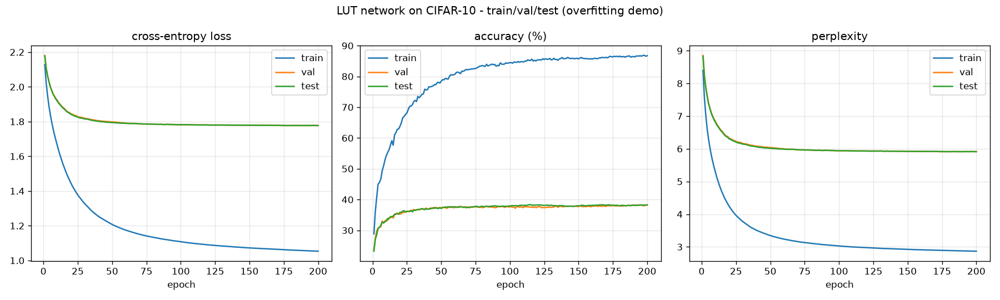

# LUT-Network Tutorial - boolean logic gates trained by gradient descent


Hi Branton this Tutorial is for you! In bad fashion I made this tutorial with Claude and reviewed it.

A **tiny, self-contained** introduction to *Look-Up Table (LUT) networks*: neural networks
whose neurons are learnable boolean logic gates instead of weighted sums. Everything is
pure PyTorch - **no custom CUDA kernels**, ~200 lines of model code you can read in one sitting.

We train it on CIFAR-10 with **no regularization and no data augmentation**, so you can
watch it *overfit*: training accuracy climbs toward 100% while test accuracy stalls.

## What is a LUT network?

A normal neuron computes `sigma(w*x + b)` - a weighted sum of *all* its inputs. A **LUT neuron**
instead:

1. reads a small **fixed** number of input *bits* (here **fan-in = 2**), and
2. applies a learned **2-input boolean function** to them - a 4-entry truth table.

A 2-input truth table has `2^2 = 4` entries `f(0,0), f(0,1), f(1,0), f(1,1)`. With 4 free
bits you can express **all 16** boolean functions of two inputs (AND, OR, XOR, NAND, "pass
A", "constant 0", ...). So each neuron *learns which logic gate it should be*. Stack layers
and you get a deep **combinational logic circuit** - trainable by SGD, and directly mappable
to the LUTs inside an FPGA/ASIC at inference time. 

The full pipeline - every signal between layers is a single bit:

```
image (3x32x32 pixels)
  -> Thermometer encoder    real pixel -> a few threshold bits
  -> Flatten
  -> N x LUTLayer           each neuron = a learned 2-input gate (fan-in 2)
  -> GroupSum head          popcount the final bits into 10 class scores
  -> logits
```

## How do you backprop through a boolean gate?

You can't differentiate `1[sin(z) > 0]`. The trick (the **"light" parametrization with a
`sin` activation**) is a **straight-through estimator**:

```python
hard = (sin(z) > 0)            # exact 0/1  - used in the forward pass
soft = 0.5 + 0.5*sin(z)        # smooth     - used for the gradient
bit  = hard + (soft - soft.detach())   # forward = hard, backward = d(soft)
```

Each of a neuron's 4 truth-table bits is stored as a real *latent* `z`. The forward pass is
an **exact boolean circuit** (so `train` and `eval` agree bit-for-bit); the backward pass
flows a smooth `sin` gradient that nudges each latent toward 0 or 1. `sin` is periodic, so -
unlike a sigmoid - the latent never saturates and always has a gradient. The gate itself is
evaluated with the multilinear form of a 2-input LUT (see `LUTLayer.forward` in
[`model.py`](model.py)).

## Files

| file          | what it is                                                        |
|---------------|-------------------------------------------------------------------|
| `model.py`    | the whole network: sin activation, `LUTLayer`, thermometer, head  |
| `train.py`    | CIFAR-10 loader (no torchvision) + training loop + metrics/plots   |
| `load.py`     | reload the saved checkpoint and evaluate / inspect a learned gate  |
| `results/`    | the committed run: `train.log`, `metrics.csv`, `curves.png`, `lut_cifar10.pt` |

## Setup (uv)

```bash
# install uv once: https://docs.astral.sh/uv/
curl -LsSf https://astral.sh/uv/install.sh | sh

cd lut-tutorial
uv sync          # creates .venv with torch + numpy + matplotlib (CPU or CUDA, picked automatically)
```

## Run

```bash
# Overfit a 5k CIFAR-10 subset (downloads the data on first run). CPU works; GPU is faster.
uv run python train.py --download

# Use a GPU explicitly / train on the full 50k set
uv run python train.py --download --device cuda --train-size 0 --epochs 50

# Reload the trained checkpoint and check test accuracy + peek at a learned gate
uv run python load.py
```

Data is split the conventional way: a fixed 5k validation set is held out of the 50k
training images (a 90/10 train/val split) and the standard 10k CIFAR-10 test set is kept
separate. The thermometer thresholds are fit on training data only, so there is no leakage.

Every epoch prints train/val/test **loss, accuracy and perplexity**, and the run writes
`results/train.log`, `results/metrics.csv`, `results/curves.png` and the checkpoint
`results/lut_cifar10.pt`. The committed `results/` come from a higher-capacity run that
makes the gap dramatic (a 2k train subset is easy to memorize):

```bash
uv run python train.py --train-size 2000 --num-bits 3 --width 16000 --layers 5 --epochs 200
```



The growing **gap** between the train curve and the val/test curves - train accuracy and
perplexity racing ahead while validation/test stall - is overfitting, exactly what we wanted
to demonstrate with no regularization and no augmentation.

## Knobs to play with

All in `train.py --help`: `--num-bits` (thermometer resolution), `--width` / `--layers`
(network capacity - more neurons overfit harder), `--train-size`, `--lr`, `--epochs`.
