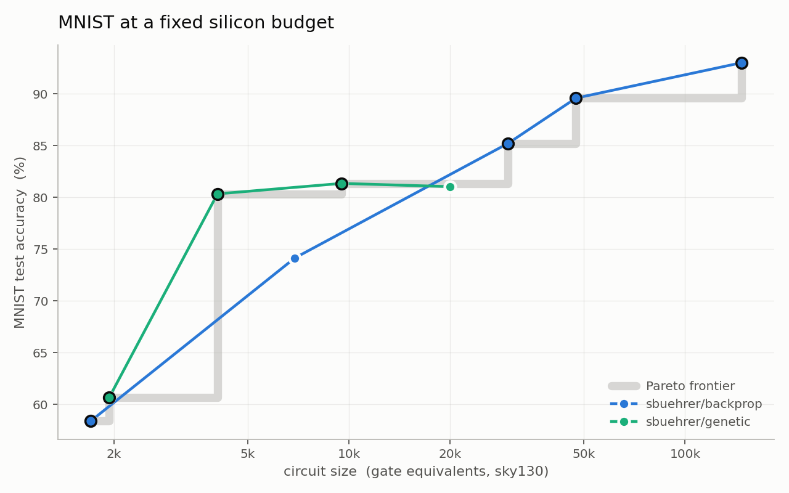

# mnistbench — benchmark optimizers by the silicon their solutions cost

Optimizers get compared on different architectures, and the comparison never means much: one
paper counts parameters, another counts "gates" (before synthesis), another counts FLOPs. This
repo fixes one task, one dataset and one cost axis, and lets any optimizer compete on it.

**You submit a training procedure and a circuit. We measure the circuit.**

|  | |
|---|---|
| **task** | MNIST, fixed 54k / 6k / 10k train / val / test split |
| **y-axis** | test accuracy, measured by **simulating your synthesized netlist** gate by gate |
| **x-axis** | circuit size in **gate equivalents (GE)**: `yosys`+`ABC` map your Verilog to sky130 standard cells; GE = area / area of a NAND2 |
| **result** | a Pareto curve — for a given amount of silicon, whose optimizer finds the best circuit? |

Everything your model does at inference lives inside the circuit and is counted: the binarizer,
the learned logic, the readout, the argmax. No free preprocessing, no free softmax. That is what
lets a LUT net, a quantized MLP and a boosted tree land on the same axis honestly.



The two reference records already make the point. Below ~15k gate equivalents the **genetic**
search owns the frontier — its NAND-only circuits map to cheaper cells, and learned wiring wastes
fewer gates than backprop's frozen random wiring. Above it, **backprop** pulls away and keeps
climbing to 93%, while the hill-climber flatlines at ~81% no matter how many gates you hand it.
Neither record could have shown that by reporting its own parameter count; it only appears once
both are charged for the same silicon.

## Leaderboard

<!-- LEADERBOARD -->
| | record | point | gate equivalents | area (um^2) | depth | MNIST test acc |
|---|---|---|---|---|---|---|
| * | `sbuehrer/backprop` | xl | 147,291 | 552,870 | 280 | **93.02%** |
| * | `sbuehrer/backprop` | l | 47,341 | 177,700 | 234 | **89.60%** |
| * | `sbuehrer/backprop` | m | 29,737 | 111,622 | 235 | **85.23%** |
| * | `sbuehrer/genetic` | m | 9,505 | 35,678 | 192 | **81.36%** |
|  | `sbuehrer/genetic` | l | 19,952 | 74,891 | 207 | **81.05%** |
| * | `sbuehrer/genetic` | s | 4,061 | 15,242 | 153 | **80.35%** |
|  | `sbuehrer/backprop` | s | 6,893 | 25,875 | 186 | **74.15%** |
| * | `sbuehrer/genetic` | xs | 1,935 | 7,262 | 128 | **60.69%** |
| * | `sbuehrer/backprop` | xs | 1,702 | 6,387 | 134 | **58.39%** |

`*` = on the Pareto frontier (nothing is both smaller and more accurate).
<!-- /LEADERBOARD -->

## The contract

```verilog
module top (input [6271:0] pix, output [3:0] cls);   // combinational; no clock, no memory
```

`pix[8*p +: 8]` is pixel `p` as a raw uint8 (row-major, `p = 0..783`); `cls` is the predicted
digit. Full rules in [docs/RULES.md](docs/RULES.md).

## Submit

```python
# records/<you>/<method>/submission.py
POINTS = [{"name": "s", ...}, {"name": "l", ...}]    # one dict per point on your curve

class Mine(Submission):
    def train(self, data, *, device, seed): ...      # data.train_x is (54000, 784) uint8 numpy
    def emit_verilog(self) -> str: ...               # the trained model, as `module top`
    def predict(self, pix): ...                      # numpy in, numpy out; must equal the verilog

def build(**point) -> Submission: return Mine(**point)
```

```bash
python -m mnistbench run records/<you>/<method>   # train -> synthesize -> simulate -> results.json
python -m mnistbench pareto                       # redraw the curve and the table
```

The harness imports **numpy and nothing else** — write your model in PyTorch, JAX, TensorFlow or
raw bit-twiddling; all we ever see is arrays and Verilog. If your model is a fan-in-2 logic net
(most are), `mnistbench/hw.py` emits the Verilog for you.

A point whose `predict()` disagrees with its own circuit on even one image is rejected, so the
accuracy on the board is always the accuracy of the hardware.

## What's here

```
mnistbench/       the harness
  data.py         MNIST as uint8 numpy, fixed split
  spec.py         the Submission API — the whole contract
  hw.py           verilog emitters: thermometer encoder, fan-in-2 LUT layers, popcount + argmax
  synth.py        yosys + ABC -> sky130 area (x-axis) and a NAND netlist
  netlist.py      bit-packed simulator, 64 images per uint64 word (y-axis)
  bench.py        train -> emit -> synth -> simulate -> results.json
  pareto.py       the curve and the leaderboard
  selftest.py     proves emit == synthesize == simulate, bit for bit
records/
  sbuehrer/backprop/   learns what each gate IS (truth tables; straight-through sin estimator)
  sbuehrer/genetic/    learns how the gates are WIRED (fixed NANDs; mutation hill-climbing)
docs/RULES.md
```

Those two records are deliberately mirror images: same encoder, same head, same gate budget —
one learns the truth tables and freezes the wiring, the other learns the wiring and freezes the
truth tables. Beat them.

## Running the scorer

Scoring needs `yosys` (with ABC) and the sky130 liberty — not pip-installable:

```bash
conda create -n eda -c conda-forge -c litex-hub yosys open_pdks.sky130a
export MNISTBENCH_YOSYS=.../eda/bin/yosys
export MNISTBENCH_LIBERTY=.../sky130_fd_sc_hd__tt_025C_1v80.lib
python -m mnistbench.selftest     # emit -> synthesize -> simulate, bit-exact
```
