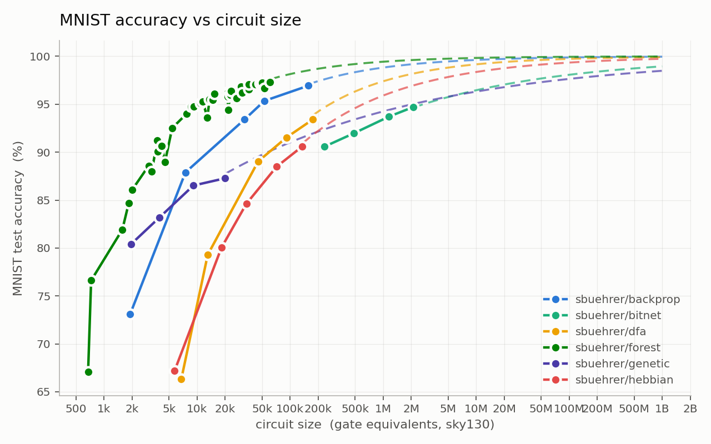
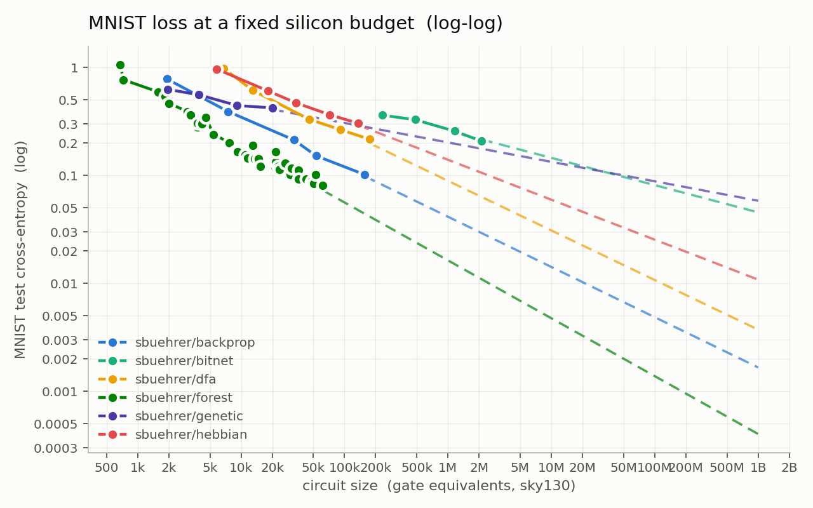

# mnistbench

Compare optimizers by the chip area their solutions cost.

Papers compare optimizers on different models, so the numbers never line up: one counts
parameters, one counts gates, one counts FLOPs. This repo picks one task, one dataset, and one
cost, and lets any optimizer compete.

**You send a training procedure and a circuit. The harness measures the circuit.**

|  | |
|---|---|
| task | MNIST, fixed 54k / 6k / 10k train / val / test split |
| x-axis | circuit size in gate equivalents (GE). `yosys` and `ABC` turn your Verilog into sky130 chip cells; GE = total area / the area of one NAND2 gate. |
| y-axis | test accuracy, and a cross-entropy loss, both read off the built circuit |

Everything the model does at run time is in the circuit and is counted: the input encoding, the
logic, the readout, the argmax. Nothing is free. That is what puts a logic net, a small MLP, and a
boosted tree on the same axis.




Solid dots are measured. The dashed line is a power-law fit, drawn past the largest circuit we
actually built.

Six records compete so far, and they do not agree. A boosted tree ensemble (`forest`) holds the
whole frontier; `backprop`, which learns the truth tables *and* the wiring, is the best of the
logic nets and wins over gradient-free search (`genetic`) above a few thousand gates. Removing the
backward pass costs a lot and removing the learned wiring costs more: `dfa` and `hebbian` fix the
wiring and teach the tables with a random projection of the error or a purely local rule, and both
sit below the frontier everywhere. Dense ternary arithmetic (`bitnet`) is the most accurate per
*parameter* and the least accurate per *gate*, landing in the millions of GE. That is the
comparison this benchmark exists to make.

Every point trains until it stops improving on the validation set, not to a fixed step count.

## Leaderboard

<!-- LEADERBOARD -->
| | record | point | gate equivalents | depth | MNIST test acc | test CE |
|---|---|---|---|---|---|---|
| * | `sbuehrer/forest` | c23 | 61,159 | 230 | **97.31%** | 0.081 |
| * | `sbuehrer/forest` | c21 | 50,412 | 229 | **97.26%** | 0.084 |
| * | `sbuehrer/forest` | xl | 47,794 | 257 | **97.20%** | 0.086 |
|  | `sbuehrer/forest` | c20 | 48,078 | 267 | **97.12%** | 0.088 |
| * | `sbuehrer/forest` | c19 | 42,459 | 192 | **97.07%** | 0.093 |
| * | `sbuehrer/forest` | c16 | 36,039 | 248 | **97.06%** | 0.093 |
|  | `sbuehrer/backprop` | xl | 156,861 | 285 | **96.93%** | 0.102 |
| * | `sbuehrer/forest` | c15 | 29,776 | 235 | **96.82%** | 0.102 |
|  | `sbuehrer/forest` | c22 | 52,668 | 198 | **96.66%** | 0.101 |
|  | `sbuehrer/forest` | c18 | 35,880 | 204 | **96.55%** | 0.112 |
| * | `sbuehrer/forest` | c13 | 23,358 | 249 | **96.40%** | 0.114 |
| * | `sbuehrer/forest` | c12 | 21,366 | 220 | **96.21%** | 0.119 |
|  | `sbuehrer/forest` | c17 | 30,755 | 238 | **96.19%** | 0.117 |
| * | `sbuehrer/forest` | l | 20,272 | 235 | **96.18%** | 0.119 |
| * | `sbuehrer/forest` | g8 | 15,449 | 206 | **96.08%** | 0.121 |
|  | `sbuehrer/forest` | c11 | 22,779 | 255 | **95.97%** | 0.121 |
|  | `sbuehrer/forest` | c9 | 21,420 | 247 | **95.80%** | 0.132 |
|  | `sbuehrer/forest` | c14 | 26,575 | 295 | **95.63%** | 0.130 |
| * | `sbuehrer/forest` | g6 | 13,605 | 218 | **95.50%** | 0.143 |
|  | `sbuehrer/forest` | g7 | 14,684 | 174 | **95.45%** | 0.143 |
|  | `sbuehrer/backprop` | l | 52,973 | 238 | **95.35%** | 0.152 |
| * | `sbuehrer/forest` | g5 | 11,554 | 170 | **95.27%** | 0.145 |
| * | `sbuehrer/forest` | g4 | 10,977 | 205 | **95.13%** | 0.154 |
| * | `sbuehrer/forest` | c7 | 8,672 | 198 | **94.76%** | 0.166 |
|  | `sbuehrer/forest` | c6 | 9,292 | 181 | **94.76%** | 0.165 |
|  | `sbuehrer/bitnet` | l | 2,111,700 | 601 | **94.71%** | 0.208 |
|  | `sbuehrer/forest` | c10 | 21,564 | 279 | **94.40%** | 0.166 |
| * | `sbuehrer/forest` | m | 7,711 | 188 | **93.99%** | 0.201 |
|  | `sbuehrer/bitnet` | m | 1,156,908 | 682 | **93.71%** | 0.257 |
|  | `sbuehrer/forest` | c8 | 12,945 | 251 | **93.58%** | 0.191 |
|  | `sbuehrer/backprop` | m | 32,425 | 237 | **93.41%** | 0.213 |
|  | `sbuehrer/dfa` | xl | 174,903 | 313 | **93.40%** | 0.216 |
| * | `sbuehrer/forest` | c5 | 5,413 | 171 | **92.52%** | 0.240 |
|  | `sbuehrer/bitnet` | s | 482,469 | 457 | **91.96%** | 0.328 |
|  | `sbuehrer/dfa` | l | 91,506 | 282 | **91.53%** | 0.265 |
| * | `sbuehrer/forest` | c3 | 3,761 | 140 | **91.21%** | 0.282 |
|  | `sbuehrer/forest` | c4 | 4,181 | 152 | **90.62%** | 0.299 |
|  | `sbuehrer/hebbian` | xl | 135,783 | 284 | **90.61%** | 0.304 |
|  | `sbuehrer/bitnet` | xs | 233,380 | 439 | **90.57%** | 0.361 |
|  | `sbuehrer/forest` | c1 | 3,791 | 151 | **90.08%** | 0.305 |
|  | `sbuehrer/dfa` | m | 45,455 | 244 | **89.04%** | 0.331 |
|  | `sbuehrer/forest` | c0 | 4,522 | 182 | **88.94%** | 0.345 |
| * | `sbuehrer/forest` | s | 3,027 | 141 | **88.59%** | 0.389 |
|  | `sbuehrer/hebbian` | l | 71,640 | 270 | **88.48%** | 0.365 |
|  | `sbuehrer/forest` | c2 | 3,255 | 153 | **87.96%** | 0.364 |
|  | `sbuehrer/backprop` | s | 7,514 | 188 | **87.89%** | 0.390 |
|  | `sbuehrer/genetic` | l | 20,114 | 206 | **87.28%** | 0.422 |
|  | `sbuehrer/genetic` | m | 9,146 | 191 | **86.52%** | 0.444 |
| * | `sbuehrer/forest` | g3 | 2,012 | 134 | **86.08%** | 0.466 |
| * | `sbuehrer/forest` | g2 | 1,960 | 133 | **85.91%** | 0.460 |
| * | `sbuehrer/forest` | xs | 1,848 | 142 | **84.69%** | 0.538 |
|  | `sbuehrer/hebbian` | m | 33,958 | 239 | **84.62%** | 0.470 |
|  | `sbuehrer/genetic` | s | 3,920 | 156 | **83.16%** | 0.558 |
| * | `sbuehrer/forest` | g1 | 1,577 | 132 | **81.92%** | 0.593 |
|  | `sbuehrer/genetic` | xs | 1,945 | 129 | **80.38%** | 0.627 |
|  | `sbuehrer/hebbian` | s | 18,322 | 227 | **80.04%** | 0.604 |
|  | `sbuehrer/dfa` | s | 13,036 | 206 | **79.29%** | 0.612 |
| * | `sbuehrer/forest` | g0 | 728 | 99 | **76.61%** | 0.769 |
|  | `sbuehrer/backprop` | xs | 1,913 | 130 | **73.10%** | 0.782 |
|  | `sbuehrer/hebbian` | xs | 5,752 | 177 | **67.21%** | 0.970 |
| * | `sbuehrer/forest` | tiny | 676 | 115 | **67.07%** | 1.062 |
|  | `sbuehrer/dfa` | xs | 6,776 | 192 | **66.30%** | 0.978 |

`*` = on the Pareto frontier (nothing is both smaller and more accurate). test CE = calibrated cross-entropy over the circuit's class votes.
<!-- /LEADERBOARD -->

## Add your optimizer

Write `records/<you>/<method>/submission.py`:

```python
POINTS = [{"name": "s", ...}, {"name": "l", ...}]    # one dict per point on your curve

class Mine(Submission):
    def train(self, data, *, device, seed): ...      # data.train_x is (54000, 784) uint8 numpy
    def emit_verilog(self) -> str: ...               # your trained model, as module top
    def predict(self, pix): ...                      # numpy in, numpy out; must match the verilog

def build(**point) -> Submission: return Mine(**point)
```

Then:

```bash
python -m mnistbench run records/<you>/<method>   # train, build the circuit, measure it
python -m mnistbench pareto                        # redraw the plots and the table
```

The harness only uses numpy, so write the model in PyTorch, JAX, TensorFlow, or plain code. It
only ever sees arrays and Verilog. If your model is a fan-in-2 logic net, `mnistbench/hw.py` writes
the Verilog for you.

Your circuit must match `predict()` on every test image, or the point is dropped. So the score on
the board is the score of the hardware.

The circuit has one fixed shape:

```verilog
module top (input [6271:0] pix, output [3:0] cls);   // combinational; no clock, no memory
```

`pix[8*p +: 8]` is pixel `p` as a raw byte (row-major, `p = 0..783`); `cls` is the digit. Full
rules in [docs/RULES.md](docs/RULES.md).

## What's here

```
mnistbench/     the harness
  data.py       MNIST as uint8 numpy, fixed split
  spec.py       the submission API
  hw.py         Verilog: thermometer encoder, fan-in-2 LUT layers, popcount + argmax
  synth.py      yosys + ABC to chip area and a NAND netlist
  netlist.py    bit-packed simulator, 64 images per word
  bench.py      train, emit, synth, simulate
  pareto.py     the plots and the leaderboard
  selftest.py   checks emit == synth == simulate, bit for bit
records/sbuehrer/
  backprop/     learns each gate and its wiring by gradient descent
  genetic/      fixes every gate to NAND, learns only the wiring by mutation
  dfa/          fixes the wiring, learns the tables by direct feedback alignment
  hebbian/      fixes the wiring, learns the tables by a local three-factor rule
  forest/       SAMME-boosted decision trees over the thermometer bits
  bitnet/       ternary weights, binary activations, dense arithmetic
```

The records share an encoder and a readout, so what differs between their curves is the optimizer
and the model it searches over. `backprop` and `genetic` are the tightest pair: same encoder, same
readout, same gate budget, one with a gradient and one without. Every gate can be a NAND, and NANDs
alone can build any circuit, so the genetic search could in principle find anything backprop finds.
What sets them apart is the search, not the model. `dfa` and `hebbian` are the other controlled
pair: identical fixed butterfly wiring, differing only in what teaches the tables.

## Running the scorer

Scoring needs `yosys` (with ABC) and the sky130 library, which are not on pip:

```bash
conda create -n eda -c conda-forge -c litex-hub yosys open_pdks.sky130a
export MNISTBENCH_YOSYS=.../eda/bin/yosys
export MNISTBENCH_LIBERTY=.../sky130_fd_sc_hd__tt_025C_1v80.lib
python -m mnistbench.selftest     # emit, synthesize, simulate, bit-exact
```
